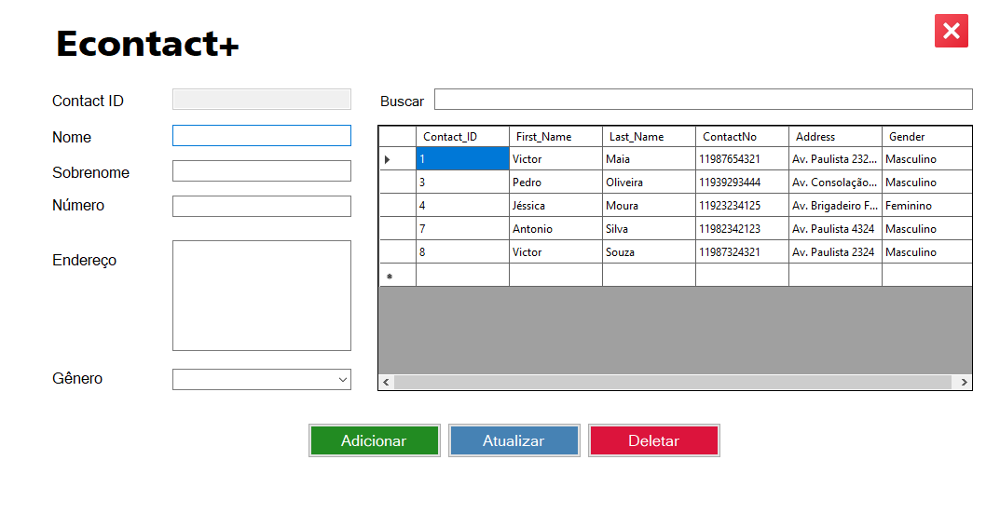

# Econtact - Gerenciador de Contatos

Bem-vindo ao **Econtact**, um aplicativo desktop simples, mas poderoso, para gerenciar seus contatos utilizando SQLite como banco de dados. 




## ✨ Funcionalidades

- **CRUD Completo**: Criação, Leitura, Atualização e Exclusão de contatos.
- **Pesquisa Dinâmica**: Pesquise contatos facilmente pelo nome, sobrenome, número de contato ou endereço.
- **Interface de Usuário Amigável**: Interface intuitiva com suporte para adição e edição de contatos.
- **Banco de Dados Local**: Utiliza SQLite para armazenar os dados localmente.

## 🚀 Como Executar

### Pré-requisitos

- [.NET Framework](https://dotnet.microsoft.com/download/dotnet-framework) instalado na sua máquina.
- IDE compatível (como Visual Studio).

### Passos

1. Clone o repositório:
    ```bash
    git clone https://github.com/seu-usuario/econtact.git
    ```
2. Abra o projeto na sua IDE preferida.
3. Compile e execute o projeto.
4. A aplicação criará automaticamente o banco de dados SQLite (`contact.db`) e a tabela necessária para armazenar os contatos.

## 🛠️ Tecnologias Utilizadas

- **C#**: Linguagem principal utilizada para desenvolvimento.
- **Windows Forms**: Para criar a interface gráfica da aplicação.
- **SQLite**: Banco de dados relacional utilizado para armazenar os contatos.

## 📂 Estrutura do Projeto

```plaintext
Econtact/
│
├── ContactModel/
│   └── Contact.cs              # Classe de modelo para os contatos.
│
├── DataBaseContext/
│   └── dbContext.cs            # Classe de contexto para manipulação do banco de dados SQLite.
│
├── DALContacts.cs               # Classe de Acesso a Dados (DAL) para operações com o banco de dados.
└── Econtact.cs                 # Form principal da aplicação.
```

## 📝 Licença

Este projeto está sob a licença [MIT](https://opensource.org/licenses/MIT).


## 🤝 Contribuições

Sinta-se à vontade para contribuir com melhorias, correções de bugs ou novas funcionalidades.
